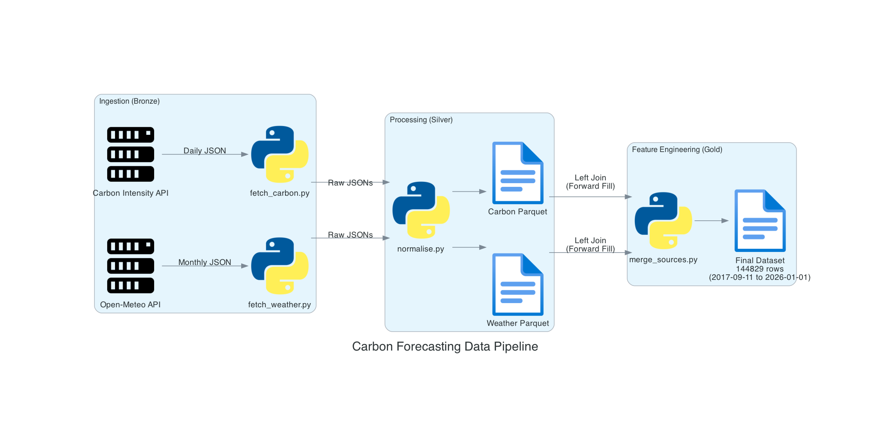
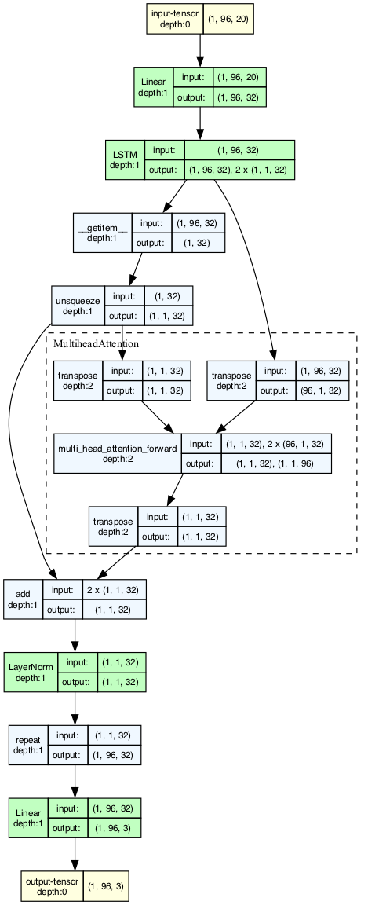

# Carbon Intensity Forecasting: Temporal Fusion Transformer
A production-grade MLOps pipeline for forecasting grid carbon intensity (gCO₂/kWh) 96-hours ahead using a Temporal Fusion Transformer (TFT). This project demonstrates an end-to-end machine learning lifecycle, from data ingestion and versioning to model deployment and monitoring.

## Quick Start

#### 1. Installation
1. Clone the repository

```bash
git clone https://github.com/j-tom03/carbon-forecasting.git
cd carbon-forecasting
```

2. Install dependencies with uv (install [here](https://docs.astral.sh/uv/getting-started/installation/))
```bash
uv sync
```

#### 2. Data Ingestion
This project uses a centralised ETL orchestrator. Running of individual scripts is not necessary.

To fetch and process the dataset:
```bash
python scripts/ingest_data.py --start 2017-09-11 --end 2026-01-01
```

This command performs the following steps automatically:

- **Fetch Carbon**: Downloads daily grid intensity data (National Grid ESO).

- **Fetch Weather**: Downloads monthly historical weather for the UK centroid (Open-Meteo).

- **Normalise**: Converts raw JSON to typed Parquet (Silver Layer).

- **Merge**: Joins datasets, handles resolution mismatch (30min vs 60min), and flags missing data.

- **Document**: Generates a Metadata Sidecar (`dataset_v1_meta.json`) and updates the Lineage Diagram.

#### 3. Data Versioning (DVC)

Large data files are not committed to Git. We use DVC (Data Version Control) to track the `data/` directory.

To pull the exact dataset used for the latest model training:

```bash
dvc pull
```

To update the dataset after running ingestion:

```bash
dvc add data/raw data/processed
git add data/raw.dvc data/processed.dvc
git commit -m "Update dataset versions"
```

#### 4. Build Dataset
To split the processed data into training, validation, and test sets (saved as tensors):

```bash
python scripts/build_features.py --config configs/data_config.yaml
```

#### 5. Model Training
To train a single model using the default configuration:

```bash
python scripts/train.py --config configs/train_tft.yaml
```

This will:

- Train the TFT model on the GPU/MPS (Apple Silicon) if available.

- Log metrics (Loss, MAE, Coverage) and parameters to MLflow.

- Save the best model to models/checkpoints/best_model.pt.

- Generate a forecast sanity check plot.

#### 6. Hyperparameter Optimisation (HPO)

To automatically find the best model configuration and promote it to production:

```bash
python scripts/run_hpo.py --n_trials 10
```

This runs an Optuna study to tune learning rate, hidden size, and dropout. The best performing trial is automatically re-trained and saved as the production candidate.


## Data Architecture
The system follows a Medallion Architecture to ensure data quality and traceability:

- Bronze (Raw): Immutable JSON dumps from National Grid ESO and Open-Meteo APIs.

- Silver (Normalised): Cleaned, strictly-typed Parquet tables with aligned timestamps.

- Gold (Feature Store): The final merged dataset with forward-filled weather covariates, data quality flags, and metadata sidecars.



_Automated architecture diagram generated by src/utils/generate_lineage.py_

## Model Architecture

The forecasting engine is a custom implementation of the **Temporal Fusion Transformer (TFT)** using PyTorch. It is designed to interpret complex temporal dynamics across multiple horizons.

**Key Specifications:**
- **Input (Lookback):** 96 hours (4 days) of historical context.
- **Output (Horizon):** 192 hours (8 days) of future forecasts.
- **Probabilistic Output:** Predicts the 10th, 50th (Median), and 90th percentiles using **Quantile Loss**, providing a calibrated "Cone of Uncertainty" alongside the point forecast.
- **Features:**
  - *Time-Varying:* Carbon intensity, Wind speed, Solar radiation, Temperature.
  - *Static:* Month, Day-of-week, Hour-of-day (cyclical encoding).

#### Design Principles
- Reproducible experiments over ad-hoc notebooks
- Automation over manual intervention
- Production-aware ML system design



_Automated architecture diagram generated by src/utils/visualise_model.py_

## Data Structure
```text
data/
├── raw/                     # (Bronze) Immutable source data [DVC Tracked]
├── processed/               # (Silver/Gold) Cleaned data [DVC Tracked]
│   ├── dataset_v1.parquet   # Final training data (144k+ rows)
│   └── dataset_v1_meta.json # Audit trail (Rows, Columns, Quality Report) [Git Tracked]
└── ...
```

## Project Structure
```text
├── configs/               # YAML configuration files
├── data/                  # Data directory (managed by DVC)
├── docs/                  # Documentation & Assets
├── models/                # Saved checkpoints & Production artifacts
├── notebooks/             # Exploratory Analysis (EDA)
├── scripts/               # CLI Entrypoints (ingest, train, tune)
├── src/                   # Source Code
   ├── api/                # FastAPI Application
   ├── data_ingestion/     # Data Ingestion scripts
   ├── features/           # Raw data feature extraction
   ├── models/             # PyTorch Model Definitions
   ├── training/           # Training Loops & Dataloaders
   └── utils/              # Utility functions
```


## Dependencies
This project relies on a modern Python ML stack, including:
- Deep learning and time-series modelling
- Experiment tracking and model registry
- Hyperparameter optimisation
- API serving and orchestration

A full dependency list is defined in `pyproject.toml`.

#### Hardware Requirements
- CPU-only training supported
- GPU optional for faster experimentation

## MLOps & Experiment Tracking
This project uses **MLflow** for strict experiment tracking and **Optuna** for automated hyperparameter tuning.

### Experiment Registry
To view training runs, metrics, and artifacts, launch the local MLflow UI:

```bash
mlflow ui
```

Every training run captures an Immutable Run Context to ensure total reproducibility:

- **Git Commit Hash**: The exact code version used.

- **Data Hash**: MD5 checksum of the training dataset.

- **Config Artifact**: A copy of the YAML configuration file.

- **Sanity Plot**: A generated chart showing the forecast vs. actuals for validation.

#### Production Artifacts

Successful training runs generate a "Deployment Package" in models/tft_prod/, containing:

- **model.pt**: The optimised PyTorch model weights.

- **metadata.json**: A JSON sidecar defining the model architecture, feature names, and scaling parameters required for inference.


## Deployment
The trained model is exposed via a RESTful inference API, designed for low-latency probabilistic forecasts. The service supports versioned models and is deployable using containerisation on free-tier cloud infrastructure.

Deployment instructions and API documentation will be added once the service is live.


## Modelling Assumptions
- Weather data is taken from the UK centroid co-ordinates $(54 °N, 2.5°W)$
    - Simplifies modelling, preventing requirement to aggregate from hundreds of weather points